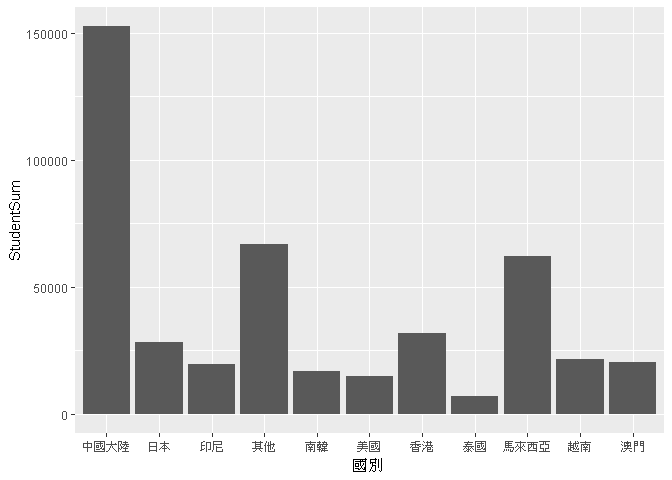
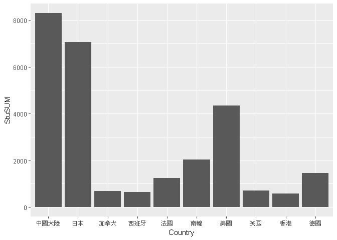

106-2 大數據分析方法 作業二
================
Yi-Ju Tseng

作業完整說明[連結](https://docs.google.com/document/d/1aLGSsGXhgOVgwzSg9JdaNz2qGPQJSoupDAQownkGf_I/edit?usp=sharing)

學習再也不限定在自己出生的國家，台灣每年有許多學生選擇就讀國外的大專院校，同時也有人多國外的學生來台灣就讀，透過分析[大專校院境外學生人數統計](https://data.gov.tw/dataset/6289)、[大專校院本國學生出國進修交流數](https://data.gov.tw/dataset/24730)、[世界各主要國家之我國留學生人數統計表](https://ws.moe.edu.tw/Download.ashx?u=C099358C81D4876CC7586B178A6BD6D5062C39FB76BDE7EC7685C1A3C0846BCDD2B4F4C2FE907C3E7E96F97D24487065577A728C59D4D9A4ECDFF432EA5A114C8B01E4AFECC637696DE4DAECA03BB417&n=4E402A02CE6F0B6C1B3C7E89FDA1FAD0B5DDFA6F3DA74E2DA06AE927F09433CFBC07A1910C169A1845D8EB78BD7D60D7414F74617F2A6B71DC86D17C9DA3781394EF5794EEA7363C&icon=..csv)可以了解103年以後各大專院校國際交流的情形。請同學分析以下議題，並以視覺化的方式呈現分析結果，呈現103年以後大專院校國際交流的情形。

來台境外生分析
--------------

### 資料匯入與處理

``` r
library(readr)

StuCountry103 <- read_csv("C:/Users/Daniel/Downloads/103_ab103_C.csv")
```

    ## Parsed with column specification:
    ## cols(
    ##   洲別 = col_character(),
    ##   國別 = col_character(),
    ##   `學位生-正式修讀學位外國生` = col_integer(),
    ##   `學位生-僑生(含港澳)` = col_integer(),
    ##   `學位生-正式修讀學位陸生` = col_integer(),
    ##   `非學位生-外國交換生` = col_integer(),
    ##   `非學位生-外國短期研習及個人選讀` = col_integer(),
    ##   `非學位生-大專附設華語文中心學生` = col_integer(),
    ##   `非學位生-大陸研修生` = col_integer(),
    ##   `非學位生-海青班` = col_integer(),
    ##   境外專班 = col_integer()
    ## )

``` r
StuCountry104 <- read_csv("C:/Users/Daniel/Downloads/104_ab104_C.csv")
```

    ## Parsed with column specification:
    ## cols(
    ##   洲別 = col_character(),
    ##   國別 = col_character(),
    ##   `學位生-正式修讀學位外國生` = col_integer(),
    ##   `學位生-僑生(含港澳)` = col_integer(),
    ##   `學位生-正式修讀學位陸生` = col_integer(),
    ##   `非學位生-外國交換生` = col_integer(),
    ##   `非學位生-外國短期研習及個人選讀` = col_integer(),
    ##   `非學位生-大專附設華語文中心學生` = col_integer(),
    ##   `非學位生-大陸研修生` = col_integer(),
    ##   `非學位生-海青班` = col_integer(),
    ##   境外專班 = col_integer()
    ## )

``` r
StuCountry105 <- read_csv("C:/Users/Daniel/Downloads/105_ab105_C.csv")
```

    ## Parsed with column specification:
    ## cols(
    ##   洲別 = col_character(),
    ##   國別 = col_character(),
    ##   學位生_正式修讀學位外國生 = col_integer(),
    ##   `學位生_僑生(含港澳)` = col_integer(),
    ##   學位生_正式修讀學位陸生 = col_integer(),
    ##   非學位生_外國交換生 = col_integer(),
    ##   非學位生_外國短期研習及個人選讀 = col_integer(),
    ##   非學位生_大專附設華語文中心學生 = col_integer(),
    ##   非學位生_大陸研修生 = col_integer(),
    ##   非學位生_海青班 = col_integer(),
    ##   境外專班 = col_integer()
    ## )

``` r
StuCountry106 <- read_csv("C:/Users/Daniel/Downloads/106_ab105_C.csv")
```

    ## Parsed with column specification:
    ## cols(
    ##   洲別 = col_character(),
    ##   國別 = col_character(),
    ##   學位生_正式修讀學位外國生 = col_integer(),
    ##   `學位生_僑生(含港澳)` = col_integer(),
    ##   學位生_正式修讀學位陸生 = col_integer(),
    ##   非學位生_外國交換生 = col_integer(),
    ##   非學位生_外國短期研習及個人選讀 = col_integer(),
    ##   非學位生_大專附設華語文中心學生 = col_integer(),
    ##   非學位生_大陸研修生 = col_integer(),
    ##   非學位生_海青班 = col_integer(),
    ##   境外專班 = col_integer()
    ## )

``` r
StuCountry103$`學位生-正式修讀學位外國生`<-as.numeric(StuCountry103$`學位生-正式修讀學位外國生`)
StuCountry103$`學位生-僑生(含港澳)`<-as.numeric(StuCountry103$`學位生-僑生(含港澳)`)
StuCountry103$`學位生-正式修讀學位陸生`<-as.numeric(StuCountry103$`學位生-正式修讀學位陸生`)
StuCountry103$`非學位生-外國交換生`<-as.numeric(StuCountry103$`非學位生-外國交換生`)
StuCountry103$`非學位生-外國短期研習及個人選讀`<-as.numeric(StuCountry103$`非學位生-外國短期研習及個人選讀`)
StuCountry103$`非學位生-大專附設華語文中心學生`<-as.numeric(StuCountry103$`非學位生-大專附設華語文中心學生`)
StuCountry103$`非學位生-大陸研修生`<-as.numeric(StuCountry103$`非學位生-大陸研修生`)
StuCountry103$`非學位生-海青班`<-as.numeric(StuCountry103$`非學位生-海青班`)
StuCountry103$境外專班<-as.numeric(StuCountry103$境外專班)


StuCountry104$`學位生-正式修讀學位外國生`<-as.numeric(StuCountry104$`學位生-正式修讀學位外國生`)
StuCountry104$`學位生-僑生(含港澳)`<-as.numeric(StuCountry104$`學位生-僑生(含港澳)`)
StuCountry104$`學位生-正式修讀學位陸生`<-as.numeric(StuCountry104$`學位生-正式修讀學位陸生`)
StuCountry104$`非學位生-外國交換生`<-as.numeric(StuCountry104$`非學位生-外國交換生`)
StuCountry104$`非學位生-外國短期研習及個人選讀`<-as.numeric(StuCountry104$`非學位生-外國短期研習及個人選讀`)
StuCountry104$`非學位生-大專附設華語文中心學生`<-as.numeric(StuCountry104$`非學位生-大專附設華語文中心學生`)
StuCountry104$`非學位生-大陸研修生`<-as.numeric(StuCountry104$`非學位生-大陸研修生`)
StuCountry104$`非學位生-海青班`<-as.numeric(StuCountry104$`非學位生-海青班`)
StuCountry104$境外專班<-as.numeric(StuCountry104$境外專班)


StuCountry105$學位生_正式修讀學位外國生<-as.numeric(StuCountry105$學位生_正式修讀學位外國生)
StuCountry105$`學位生_僑生(含港澳)`<-as.numeric(StuCountry105$`學位生_僑生(含港澳)`)
StuCountry105$學位生_正式修讀學位陸生<-as.numeric(StuCountry105$學位生_正式修讀學位陸生)
StuCountry105$非學位生_外國交換生<-as.numeric(StuCountry105$非學位生_外國交換生)
StuCountry105$非學位生_外國短期研習及個人選讀<-as.numeric(StuCountry105$非學位生_外國短期研習及個人選讀)
StuCountry105$非學位生_大專附設華語文中心學生<-as.numeric(StuCountry105$非學位生_大專附設華語文中心學生)
StuCountry105$非學位生_大陸研修生<-as.numeric(StuCountry105$非學位生_大陸研修生)
StuCountry105$非學位生_海青班<-as.numeric(StuCountry105$非學位生_海青班)
StuCountry105$境外專班<-as.numeric(StuCountry105$境外專班)


StuCountry106$學位生_正式修讀學位外國生<-as.numeric(StuCountry106$學位生_正式修讀學位外國生)
StuCountry106$`學位生_僑生(含港澳)`<-as.numeric(StuCountry106$`學位生_僑生(含港澳)`)
StuCountry106$學位生_正式修讀學位陸生<-as.numeric(StuCountry106$學位生_正式修讀學位陸生)
StuCountry106$非學位生_外國交換生<-as.numeric(StuCountry106$非學位生_外國交換生)
StuCountry106$非學位生_外國短期研習及個人選讀<-as.numeric(StuCountry106$非學位生_外國短期研習及個人選讀)
StuCountry106$非學位生_大專附設華語文中心學生<-as.numeric(StuCountry106$非學位生_大專附設華語文中心學生)
StuCountry106$非學位生_大陸研修生<-as.numeric(StuCountry106$非學位生_大陸研修生)
StuCountry106$非學位生_海青班<-as.numeric(StuCountry106$非學位生_海青班)
StuCountry106$境外專班<-as.numeric(StuCountry106$境外專班)


library(dplyr)
```

    ## 
    ## Attaching package: 'dplyr'

    ## The following objects are masked from 'package:stats':
    ## 
    ##     filter, lag

    ## The following objects are masked from 'package:base':
    ## 
    ##     intersect, setdiff, setequal, union

``` r
StuCountry103<-
              StuCountry103 %>% 
                mutate(StudentSum103=`學位生-正式修讀學位外國生` +
                         `學位生-僑生(含港澳)` + `學位生-正式修讀學位陸生` +
                         `非學位生-外國交換生` + `非學位生-外國短期研習及個人選讀` +
                         `非學位生-大專附設華語文中心學生` + `非學位生-大陸研修生` +
                         `非學位生-海青班` + 境外專班) %>% 
                select("國別", StudentSum103)
StuCountry104<-
              StuCountry104 %>% 
                mutate(StudentSum104=`學位生-正式修讀學位外國生` +
                         `學位生-僑生(含港澳)` + `學位生-正式修讀學位陸生` +
                         `非學位生-外國交換生` + `非學位生-外國短期研習及個人選讀` +
                         `非學位生-大專附設華語文中心學生` + `非學位生-大陸研修生` +
                         `非學位生-海青班` + 境外專班) %>% 
                select("國別", StudentSum104)
StuCountry105<-
              StuCountry105 %>% 
                mutate(StudentSum105=學位生_正式修讀學位外國生 +
                         `學位生_僑生(含港澳)` + 學位生_正式修讀學位陸生 +
                         非學位生_外國交換生 + 非學位生_外國短期研習及個人選讀 +
                         非學位生_大專附設華語文中心學生 + 非學位生_大陸研修生 +
                         非學位生_海青班 + 境外專班) %>% 
                select("國別", StudentSum105)
StuCountry106<-
              StuCountry106 %>% 
                mutate(StudentSum106=學位生_正式修讀學位外國生 +
                         `學位生_僑生(含港澳)` + 學位生_正式修讀學位陸生 +
                         非學位生_外國交換生 + 非學位生_外國短期研習及個人選讀 +
                         非學位生_大專附設華語文中心學生 + 非學位生_大陸研修生 +
                         非學位生_海青班 + 境外專班) %>% 
                select("洲別","國別", StudentSum106)


ByCountry<-
          inner_join(StuCountry106,StuCountry105,by="國別") %>%
          inner_join(StuCountry104,by="國別") %>%
          inner_join(StuCountry103,by="國別")
ByCountry<-
          ByCountry %>%
            mutate(StudentSum = 
                     StudentSum103 + StudentSum104 + 
                     StudentSum105 + StudentSum106) %>%
            select("洲別","國別", StudentSum) %>%
            arrange(desc(StudentSum))


library(readr)

StuSchool103 <- read_csv("C:/Users/Daniel/Downloads/103_ab103_S.csv")
```

    ## Parsed with column specification:
    ## cols(
    ##   學校類型 = col_character(),
    ##   學校代碼 = col_character(),
    ##   學校名稱 = col_character(),
    ##   `學位生-正式修讀學位外國生` = col_integer(),
    ##   `學位生-僑生(含港澳)` = col_integer(),
    ##   `學位生-正式修讀學位陸生` = col_integer(),
    ##   `非學位生-外國交換生` = col_integer(),
    ##   `非學位生-外國短期研習及個人選讀` = col_integer(),
    ##   `非學位生-大專附設華語文中心學生` = col_integer(),
    ##   `非學位生-大陸研修生` = col_character(),
    ##   `非學位生-海青班` = col_integer(),
    ##   境外專班 = col_integer()
    ## )

``` r
StuSchool104 <- read_csv("C:/Users/Daniel/Downloads/104_ab104_S.csv")
```

    ## Parsed with column specification:
    ## cols(
    ##   學校類型 = col_character(),
    ##   學校代碼 = col_character(),
    ##   學校名稱 = col_character(),
    ##   `學位生-正式修讀學位外國生` = col_integer(),
    ##   `學位生-僑生(含港澳)` = col_integer(),
    ##   `學位生-正式修讀學位陸生` = col_integer(),
    ##   `非學位生-外國交換生` = col_integer(),
    ##   `非學位生-外國短期研習及個人選讀` = col_integer(),
    ##   `非學位生-大專附設華語文中心學生` = col_integer(),
    ##   `非學位生-大陸研修生` = col_character(),
    ##   `非學位生-海青班` = col_integer(),
    ##   境外專班 = col_integer()
    ## )

``` r
StuSchool105 <- read_csv("C:/Users/Daniel/Downloads/105_ab105_S.csv")
```

    ## Parsed with column specification:
    ## cols(
    ##   學校類型 = col_character(),
    ##   學校代碼 = col_character(),
    ##   學校名稱 = col_character(),
    ##   學位生_正式修讀學位外國生 = col_integer(),
    ##   `學位生_僑生(含港澳)` = col_integer(),
    ##   學位生_正式修讀學位陸生 = col_integer(),
    ##   非學位生_外國交換生 = col_integer(),
    ##   非學位生_外國短期研習及個人選讀 = col_integer(),
    ##   非學位生_大專附設華語文中心學生 = col_integer(),
    ##   非學位生_大陸研修生 = col_integer(),
    ##   非學位生_海青班 = col_integer(),
    ##   境外專班 = col_integer()
    ## )

``` r
StuSchool106 <- read_csv("C:/Users/Daniel/Downloads/106_ab105_S.csv")
```

    ## Parsed with column specification:
    ## cols(
    ##   學校類型 = col_character(),
    ##   學校代碼 = col_character(),
    ##   學校名稱 = col_character(),
    ##   學位生_正式修讀學位外國生 = col_integer(),
    ##   `學位生_僑生(含港澳)` = col_integer(),
    ##   學位生_正式修讀學位陸生 = col_integer(),
    ##   非學位生_外國交換生 = col_integer(),
    ##   非學位生_外國短期研習及個人選讀 = col_integer(),
    ##   非學位生_大專附設華語文中心學生 = col_integer(),
    ##   非學位生_大陸研修生 = col_integer(),
    ##   非學位生_海青班 = col_integer(),
    ##   境外專班 = col_integer()
    ## )

``` r
StuSchool103 <-StuSchool103 %>% mutate_all(funs(gsub("…","0",.)))
StuSchool104 <-StuSchool104 %>% mutate_all(funs(gsub("…","0",.)))
StuSchool105 <-StuSchool105 %>% mutate_all(funs(gsub("…","0",.)))
StuSchool106 <-StuSchool106 %>% mutate_all(funs(gsub("…","0",.)))

StuSchool103$`學位生-正式修讀學位外國生`<-as.numeric(StuSchool103$`學位生-正式修讀學位外國生`)
StuSchool103$`學位生-僑生(含港澳)`<-as.numeric(StuSchool103$`學位生-僑生(含港澳)`)
StuSchool103$`學位生-正式修讀學位陸生`<-as.numeric(StuSchool103$`學位生-正式修讀學位陸生`)
StuSchool103$`非學位生-外國交換生`<-as.numeric(StuSchool103$`非學位生-外國交換生`)
StuSchool103$`非學位生-外國短期研習及個人選讀`<-as.numeric(StuSchool103$`非學位生-外國短期研習及個人選讀`)
StuSchool103$`非學位生-大專附設華語文中心學生`<-as.numeric(StuSchool103$`非學位生-大專附設華語文中心學生`)
StuSchool103$`非學位生-大陸研修生`<-as.numeric(StuSchool103$`非學位生-大陸研修生`)
StuSchool103$`非學位生-海青班`<-as.numeric(StuSchool103$`非學位生-海青班`)
StuSchool103$境外專班<-as.numeric(StuSchool103$境外專班)

StuSchool104$`學位生-正式修讀學位外國生`<-as.numeric(StuSchool104$`學位生-正式修讀學位外國生`)
StuSchool104$`學位生-僑生(含港澳)`<-as.numeric(StuSchool104$`學位生-僑生(含港澳)`)
StuSchool104$`學位生-正式修讀學位陸生`<-as.numeric(StuSchool104$`學位生-正式修讀學位陸生`)
StuSchool104$`非學位生-外國交換生`<-as.numeric(StuSchool104$`非學位生-外國交換生`)
StuSchool104$`非學位生-外國短期研習及個人選讀`<-as.numeric(StuSchool104$`非學位生-外國短期研習及個人選讀`)
StuSchool104$`非學位生-大專附設華語文中心學生`<-as.numeric(StuSchool104$`非學位生-大專附設華語文中心學生`)
StuSchool104$`非學位生-大陸研修生`<-as.numeric(StuSchool104$`非學位生-大陸研修生`)
StuSchool104$`非學位生-海青班`<-as.numeric(StuSchool104$`非學位生-海青班`)
StuSchool104$境外專班<-as.numeric(StuSchool104$境外專班)

StuSchool105$學位生_正式修讀學位外國生<-as.numeric(StuSchool105$學位生_正式修讀學位外國生)
StuSchool105$`學位生_僑生(含港澳)`<-as.numeric(StuSchool105$`學位生_僑生(含港澳)`)
StuSchool105$學位生_正式修讀學位陸生<-as.numeric(StuSchool105$學位生_正式修讀學位陸生)
StuSchool105$非學位生_外國交換生<-as.numeric(StuSchool105$非學位生_外國交換生)
StuSchool105$非學位生_外國短期研習及個人選讀<-as.numeric(StuSchool105$非學位生_外國短期研習及個人選讀)
StuSchool105$非學位生_大專附設華語文中心學生<-as.numeric(StuSchool105$非學位生_大專附設華語文中心學生)
StuSchool105$非學位生_大陸研修生<-as.numeric(StuSchool105$非學位生_大陸研修生)
StuSchool105$非學位生_海青班<-as.numeric(StuSchool105$非學位生_海青班)
StuSchool105$境外專班<-as.numeric(StuSchool105$境外專班)

StuSchool106$學位生_正式修讀學位外國生<-as.numeric(StuSchool106$學位生_正式修讀學位外國生)
StuSchool106$`學位生_僑生(含港澳)`<-as.numeric(StuSchool106$`學位生_僑生(含港澳)`)
StuSchool106$學位生_正式修讀學位陸生<-as.numeric(StuSchool106$學位生_正式修讀學位陸生)
StuSchool106$非學位生_外國交換生<-as.numeric(StuSchool106$非學位生_外國交換生)
StuSchool106$非學位生_外國短期研習及個人選讀<-as.numeric(StuSchool106$非學位生_外國短期研習及個人選讀)
StuSchool106$非學位生_大專附設華語文中心學生<-as.numeric(StuSchool106$非學位生_大專附設華語文中心學生)
StuSchool106$非學位生_大陸研修生<-as.numeric(StuSchool106$非學位生_大陸研修生)
StuSchool106$非學位生_海青班<-as.numeric(StuSchool106$非學位生_海青班)
StuSchool106$境外專班<-as.numeric(StuSchool106$境外專班)

library(dplyr)
StuSchool103<-
  StuSchool103 %>% 
  mutate(StudentSum103=`學位生-正式修讀學位外國生` +
           `學位生-僑生(含港澳)` + `學位生-正式修讀學位陸生` +
           `非學位生-外國交換生` + `非學位生-外國短期研習及個人選讀` +
           `非學位生-大專附設華語文中心學生` + `非學位生-大陸研修生` +
           `非學位生-海青班` + 境外專班) %>% 
  select("學校名稱", StudentSum103)

StuSchool104<-
  StuSchool104 %>% 
  mutate(StudentSum104=`學位生-正式修讀學位外國生` +
           `學位生-僑生(含港澳)` + `學位生-正式修讀學位陸生` +
           `非學位生-外國交換生` + `非學位生-外國短期研習及個人選讀` +
           `非學位生-大專附設華語文中心學生` + `非學位生-大陸研修生` +
           `非學位生-海青班` + 境外專班) %>% 
  select("學校名稱", StudentSum104)

StuSchool105<-
  StuSchool105 %>% 
  mutate(StudentSum105=學位生_正式修讀學位外國生 +
           `學位生_僑生(含港澳)` + 學位生_正式修讀學位陸生 +
           非學位生_外國交換生 + 非學位生_外國短期研習及個人選讀 +
           非學位生_大專附設華語文中心學生 + 非學位生_大陸研修生 +
           非學位生_海青班 + 境外專班) %>% 
  select("學校名稱", StudentSum105)

StuSchool106<-
  StuSchool106 %>% 
  mutate(StudentSum106=學位生_正式修讀學位外國生 +
           `學位生_僑生(含港澳)` + 學位生_正式修讀學位陸生 +
           非學位生_外國交換生 + 非學位生_外國短期研習及個人選讀 +
           非學位生_大專附設華語文中心學生 + 非學位生_大陸研修生 +
           非學位生_海青班 + 境外專班) %>% 
  select("學校名稱", StudentSum106)

BySchool<-
  inner_join(StuSchool103,StuSchool104,by="學校名稱") %>%
  inner_join(StuSchool105,by="學校名稱") %>%
  inner_join(StuSchool106,by="學校名稱") %>%
  mutate(StudentSum = 
           StudentSum103 + StudentSum104 + 
           StudentSum105 + StudentSum106) %>%
  select("學校名稱", StudentSum) %>%
  arrange(desc(StudentSum))
```

### 哪些國家來台灣唸書的學生最多呢？

由表中可以看出，來台念書的學生最多來自中國大陸，其次是馬來西亞，再來依照順序分別是香港、日本、越南、澳門、印尼、南韓、美國、泰國。

``` r
ByCountryTOP10<-
               ByCountry %>%
               head(10)
library(knitr)
kable(ByCountryTOP10)
```

| 洲別 | 國別     |  StudentSum|
|:-----|:---------|-----------:|
| 亞洲 | 中國大陸 |      152524|
| 亞洲 | 馬來西亞 |       62031|
| 亞洲 | 香港     |       31940|
| 亞洲 | 日本     |       28200|
| 亞洲 | 越南     |       21670|
| 亞洲 | 澳門     |       20302|
| 亞洲 | 印尼     |       19620|
| 亞洲 | 南韓     |       16948|
| 美洲 | 美國     |       14846|
| 亞洲 | 泰國     |        7035|

### 哪間大學的境外生最多呢？

可由圖表看出境外生人數最多的是國立台灣師範大學。

``` r
BySchoolTOP10<-
              BySchool %>%
              head(10)
library(knitr)
kable(BySchoolTOP10)
```

| 學校名稱         |  StudentSum|
|:-----------------|-----------:|
| 國立臺灣師範大學 |       22113|
| 國立臺灣大學     |       18199|
| 中國文化大學     |       16074|
| 銘傳大學         |       16057|
| 淡江大學         |       13887|
| 國立政治大學     |       11626|
| 國立成功大學     |       10982|
| 輔仁大學         |        9499|
| 逢甲大學         |        9474|
| 中原大學         |        7662|

### 各個國家來台灣唸書的學生人數條狀圖

``` r
Others<- ByCountry[-c(1:10),] 

Others<-
        rbind(Others, 
              c("世界","其他",colSums(Others[,3]))  
              ) %>%
        tail(1)      

ForPlotBar<- 
            rbind(ByCountryTOP10,
                  Others )%>%
  select("國別",StudentSum)
ForPlotBar$StudentSum<-as.numeric(ForPlotBar$StudentSum)
ForPlotBar$國別<-as.factor(ForPlotBar$國別)
library(ggplot2) 

ggplot()+geom_bar(data=ForPlotBar,aes(x=國別,y=StudentSum),stat = "identity")
```



### 各個國家來台灣唸書的學生人數面量圖

``` r
#這是R Code Chunk
```

台灣學生國際交流分析
--------------------

### 資料匯入與處理

``` r
library(readr)
library(dplyr)
Student_RPT_07 <- read_csv("C:/Users/Daniel/Downloads/Student_RPT_07.csv")
```

    ## Parsed with column specification:
    ## cols(
    ##   學年度 = col_integer(),
    ##   學期 = col_integer(),
    ##   設立別 = col_character(),
    ##   學校類別 = col_character(),
    ##   學校代碼 = col_character(),
    ##   學校名稱 = col_character(),
    ##   系所代碼 = col_integer(),
    ##   系所名稱 = col_character(),
    ##   學制 = col_character(),
    ##   `對方學校(機構)國別(地區)` = col_character(),
    ##   對方學校中文名稱 = col_character(),
    ##   對方學校英文名稱 = col_character(),
    ##   本國學生出國進修交流人數 = col_integer()
    ## )

    ## Warning in rbind(names(probs), probs_f): number of columns of result is not
    ## a multiple of vector length (arg 1)

    ## Warning: 10 parsing failures.
    ## row # A tibble: 5 x 5 col     row col      expected               actual                     file    expected   <int> <chr>    <chr>                  <chr>                      <chr>   actual 1 23579 系所代碼 no trailing characters A2                         'C:/Us~ file 2 34284 系所代碼 no trailing characters A2                         'C:/Us~ row 3 35022 學年度   an integer             蝯梯?隤芣?嚗?              'C:/Us~ col 4 35023 學年度   no trailing characters ". ?祈”閮剔??乩??\uf2e7\u0080~ 'C:/Us~ expected 5 35024 學年度   no trailing characters ". ?祈”?\uf5fa飛?嗚\u0080\uf~ 'C:/Us~
    ## ... ................. ... .......................................................................... ........ .......................................................................... ...... ...................................................................... .... ...................................................................... ... .................................................................. ... ....................................................................... ........ .......................................................................
    ## See problems(...) for more details.

``` r
Student_RPT_07$學年度<-as.numeric(Student_RPT_07$學年度)
Student_RPT_07$本國學生出國進修交流人數<-as.numeric(Student_RPT_07$本國學生出國進修交流人數)

Student_RPT_07<-Student_RPT_07[complete.cases(Student_RPT_07),]

Student_RPT_07<-
  filter(Student_RPT_07,學年度>102)%>%
  select("學年度","學校名稱","對方學校(機構)國別(地區)","本國學生出國進修交流人數")%>%
  group_by("對方學校(機構)國別(地區)")
```

### 台灣大專院校的學生最喜歡去哪些國家進修交流呢？

透過表格分析，發現最多人去出國進修的國家是中國大陸，接著依照順序是日本、美國、南韓、德國、法國、英國、加拿大、西班牙及香港。

``` r
library(readr)
library(dplyr)
Student_RPT_07 <- read_csv("C:/Users/Daniel/Downloads/Student_RPT_07.csv")
```

    ## Parsed with column specification:
    ## cols(
    ##   學年度 = col_integer(),
    ##   學期 = col_integer(),
    ##   設立別 = col_character(),
    ##   學校類別 = col_character(),
    ##   學校代碼 = col_character(),
    ##   學校名稱 = col_character(),
    ##   系所代碼 = col_integer(),
    ##   系所名稱 = col_character(),
    ##   學制 = col_character(),
    ##   `對方學校(機構)國別(地區)` = col_character(),
    ##   對方學校中文名稱 = col_character(),
    ##   對方學校英文名稱 = col_character(),
    ##   本國學生出國進修交流人數 = col_integer()
    ## )

    ## Warning in rbind(names(probs), probs_f): number of columns of result is not
    ## a multiple of vector length (arg 1)

    ## Warning: 10 parsing failures.
    ## row # A tibble: 5 x 5 col     row col      expected               actual                     file    expected   <int> <chr>    <chr>                  <chr>                      <chr>   actual 1 23579 系所代碼 no trailing characters A2                         'C:/Us~ file 2 34284 系所代碼 no trailing characters A2                         'C:/Us~ row 3 35022 學年度   an integer             蝯梯?隤芣?嚗?              'C:/Us~ col 4 35023 學年度   no trailing characters ". ?祈”閮剔??乩??\uf2e7\u0080~ 'C:/Us~ expected 5 35024 學年度   no trailing characters ". ?祈”?\uf5fa飛?嗚\u0080\uf~ 'C:/Us~
    ## ... ................. ... .......................................................................... ........ .......................................................................... ...... ...................................................................... .... ...................................................................... ... .................................................................. ... ....................................................................... ........ .......................................................................
    ## See problems(...) for more details.

``` r
Student_RPT_07$學年度<-as.numeric(Student_RPT_07$學年度)
Student_RPT_07$本國學生出國進修交流人數<-as.numeric(Student_RPT_07$本國學生出國進修交流人數)

Student_RPT_07<-Student_RPT_07[complete.cases(Student_RPT_07),]
Student_RPT_07<-rename(Student_RPT_07,Country=`對方學校(機構)國別(地區)`)

DifferentCountrySum<-
  filter(Student_RPT_07,學年度>102)%>%
  select("學年度","學校名稱",Country,"本國學生出國進修交流人數")%>%
  group_by(Country)%>%
  summarise(StuSUM=sum(本國學生出國進修交流人數))%>%
  arrange(desc(StuSUM))

DifferentCountrySum<-
  DifferentCountrySum[!grepl("大陸地區",DifferentCountrySum$Country),]%>%
  head(10)
  
library(knitr)
kable(DifferentCountrySum)
```

| Country  |  StuSUM|
|:---------|-------:|
| 中國大陸 |    8302|
| 日本     |    7060|
| 美國     |    4352|
| 南韓     |    2042|
| 德國     |    1463|
| 法國     |    1249|
| 英國     |     701|
| 加拿大   |     682|
| 西班牙   |     637|
| 香港     |     568|

### 哪間大學的出國交流學生數最多呢？

最多學生出國交流的大學是國立臺灣大學，然後以下案名次排序是淡江大學、國立政治大學、逢甲大學、元智大學、國立交通大學、東海大學、國立臺北大學、東吳大學，然後是國立成功大學。

``` r
DifferentSchoolSum<-
  filter(Student_RPT_07,學年度>102)%>%
  select("學年度","學校名稱",Country,"本國學生出國進修交流人數")%>%
  group_by(學校名稱)%>%
  summarise(StuSUM=sum(本國學生出國進修交流人數))%>%
  arrange(desc(StuSUM))%>%
  head(10)

library(knitr)
kable(DifferentSchoolSum)
```

| 學校名稱     |  StuSUM|
|:-------------|-------:|
| 國立臺灣大學 |    2224|
| 淡江大學     |    2038|
| 國立政治大學 |    1876|
| 逢甲大學     |    1346|
| 元智大學     |    1106|
| 國立交通大學 |     951|
| 東海大學     |     931|
| 國立臺北大學 |     907|
| 東吳大學     |     873|
| 國立成功大學 |     846|

### 台灣大專院校的學生最喜歡去哪些國家進修交流條狀圖

``` r
library(ggplot2) 

ggplot()+geom_bar(data=DifferentCountrySum,aes(x=Country,y=StuSUM),stat = "identity")
```



### 台灣大專院校的學生最喜歡去哪些國家進修交流面量圖

``` r
#這是R Code Chunk
```

台灣學生出國留學分析
--------------------

### 資料匯入與處理

``` r
library(readr)

TaiwanToWorld105 <- read_csv("C:/Users/Daniel/Downloads/105Taiwan to World.csv")
```

    ## Warning: Missing column names filled in: 'X4' [4], 'X5' [5], 'X6' [6]

    ## Parsed with column specification:
    ## cols(
    ##   洲別 = col_character(),
    ##   國別 = col_character(),
    ##   總人數 = col_number(),
    ##   X4 = col_character(),
    ##   X5 = col_character(),
    ##   X6 = col_character()
    ## )

``` r
TaiwanToWorld105 <- 
  TaiwanToWorld105[,1:3]%>%
  arrange(desc(總人數))
  
T_to_W_top10 <-
  TaiwanToWorld105 %>%
  head(10)
```

### 台灣學生最喜歡去哪些國家留學呢？

台灣出外留學國家人數排名第一為美國，其次是澳洲，之後順序分別為日本、加拿大、英國、德國、紐西蘭、波蘭、馬來西亞跟奧地利。

``` r
library(knitr)
kable(T_to_W_top10)
```

| 洲別   | 國別     | 總人數 |
|:-------|:---------|:------:|
| 美洲   | 美國     |  21127 |
| 大洋洲 | 澳大利亞 |  13582 |
| 亞洲   | 日本     |  8444  |
| 美洲   | 加拿大   |  4827  |
| 歐洲   | 英國     |  3815  |
| 歐洲   | 德國     |  1488  |
| 大洋洲 | 紐西蘭   |  1106  |
| 歐洲   | 波蘭     |   561  |
| 亞洲   | 馬來西亞 |   502  |
| 歐洲   | 奧地利   |   419  |

### 台灣學生最喜歡去哪些國家留學面量圖

``` r
#這是R Code Chunk
```

綜合分析
--------

請問來台讀書與離台讀書的來源國與留學國趨勢是否相同(5分)？想來台灣唸書的境外生，他們的母國也有很多台籍生嗎？請圖文並茂說明你的觀察(10分)。

由以上的表格看出來台灣念書的學生大部分來自鄰近的國家，由中國大陸與東南亞占大宗；而台灣學生喜好的留學國家則偏向歐美地區及澳洲等英文語系國家，鄰近的東南亞反而算是少數。 推測是一直以來的政策以及觀念所影響造成這種情況。
